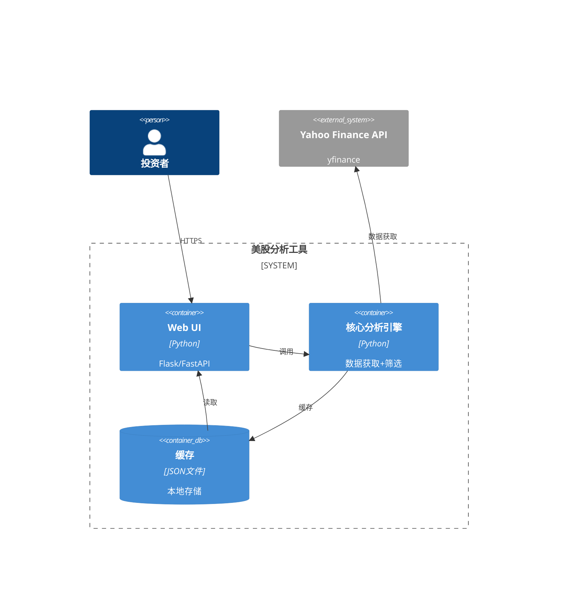
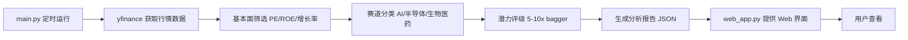

# 美股潜力股分析工具 — 架构设计

版本：v1.0 | 日期：2026-05-14 | Mermaid 图表

---

## 一、项目概述

美股潜力股分析工具，每日盘前盘后自动更新股票池价格和基本面数据，筛选 5-10 倍潜力股。聚焦三大赛道：AI/科技、半导体、生物医药。

---

## 二、系统架构



---

## 三、核心数据流



---

## 四、核心文件

| 文件 | 说明 |
|------|------|
| main.py | 数据获取 + 筛选逻辑 |
| web_app.py | Web 界面 |
| scripts/ | 定时任务 |
| SKILL.md | OpenClaw skill 格式 |

---

## 五、部署

```bash
./start_web.sh
python main.py  # 手动运行分析
```
